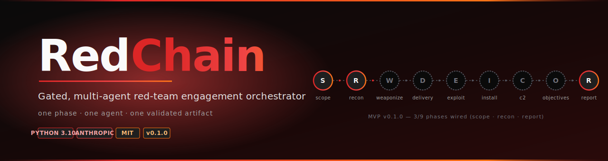

# RedChain

<p align="center">
  
</p>

> Gated, multi-agent red-team engagement orchestrator built on the Anthropic SDK.

RedChain runs offensive security engagements as a **state machine of phases**, where each phase is driven by a **specialist agent**, produces a **validated artifact**, and cannot advance until a **gate** confirms the artifact is complete. Designed for multi-day engagements with checkpoint/resume.

```
scope -> recon -> weaponize -> delivery -> exploit
       -> installation -> c2 -> objectives -> report
```

## Why another red-team agent?

| | Autonomous loops | **RedChain** |
|---|---|---|
| Execution model | One LLM in a tool-use loop | Pipeline of specialist agents |
| Phase enforcement | Tracked, not enforced | Hard gates in code |
| Determinism | Low — agent decides next step | High — orchestrator owns transitions |
| Multi-day engagement | Session-bound | Checkpoint/resume from disk |
| Audit trail | Conversation log | Artifact-per-phase + agent transcript per gate |

RedChain is the right tool when you need reproducibility, auditability, and structured deliverables — not when you want the model to freelance.

## Status

**Alpha (v0.1.0)** — MVP slice. Three phases are wired end-to-end (`scope`, `recon`, `report`) with the `webapp` preset. Remaining six phases and additional agents/skills/integrations are stubs to be filled in.

## Install

```bash
git clone https://github.com/Krishcalin/RedChain.git
cd RedChain
pip install -e ".[dev]"
```

## Quick start

```bash
# Required for live agent calls (omit if you only want --dry-run)
export ANTHROPIC_API_KEY=sk-ant-...

# Start a new engagement
redchain engage \
  --preset webapp \
  --target https://app.example.com \
  --out ./engagements/eng-001

# Resume an engagement that paused at a gate
redchain resume ./engagements/eng-001

# Inspect engagement state
redchain status ./engagements/eng-001

# List available presets
redchain list-presets

# Dry-run mode (no API calls — uses canned agent responses; useful for CI)
redchain engage --preset webapp --target https://app.example.com \
  --out ./engagements/dryrun --dry-run
```

## Engagement layout on disk

```
engagements/eng-001/
├── manifest.yaml             # engagement metadata (target, preset, started_at)
├── state.sqlite              # phase status, gate decisions, agent transcripts
├── artifacts/
│   ├── scope_brief.md
│   ├── recon_dossier.md
│   └── executive_report.md
└── transcripts/
    └── <phase>-<agent>-<ts>.jsonl  # full prompt/response trace per agent run
```

## Architecture

```
src/redchain/
├── runtime/        Orchestrator, state store (SQLite), artifact store, agent session wrapper
├── phases/         One module per Kill Chain phase — entry contract, agent dispatch, exit gate
├── agents/         Specialist agent classes (Planner, NetworkAnalyst, ...)
├── gates/          Artifact validators — block phase advance until satisfied
├── skills/         Reusable Python modules invokable from any phase
├── integrations/   Tool wrappers (nmap, gobuster, ...) — subprocess + JSON parsing
├── templates/      Jinja2 templates for phase artifacts and reports
├── presets/        YAML engagement templates (webapp, internal_net, ...)
└── vulnref/        Vulnerability pattern library, queryable by phase
```

## Development

```bash
pip install -e ".[dev]"
pytest                     # run unit tests (no API key required)
pytest -m live             # run live tests (requires ANTHROPIC_API_KEY)
ruff check src tests
mypy src
```

## License

MIT
